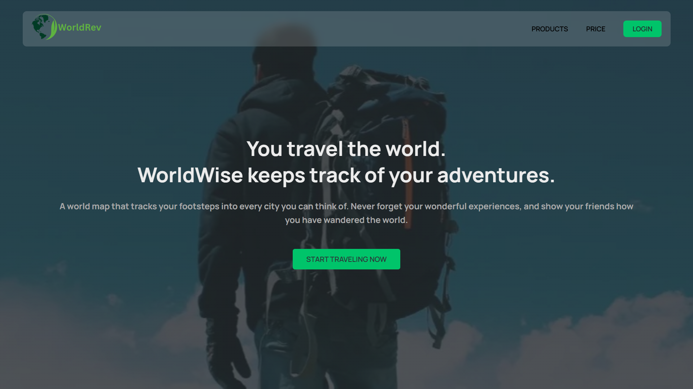
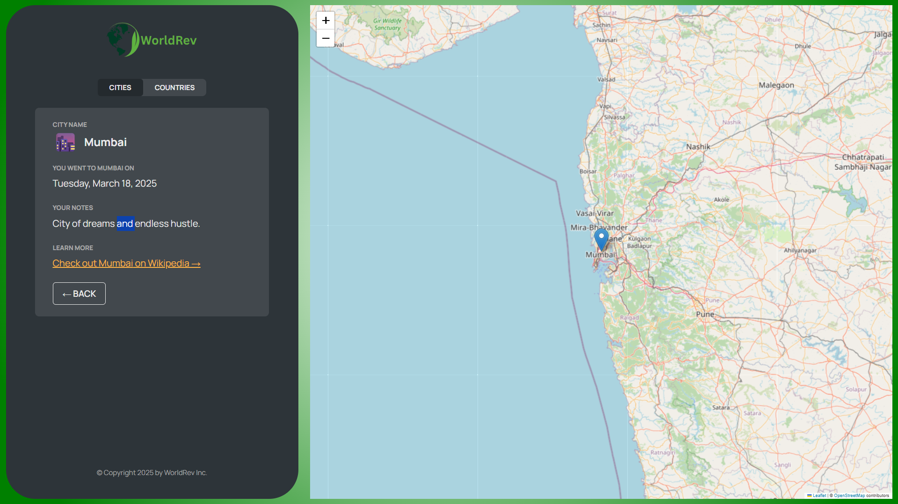

# React + Vite

🌍 WorldRev

WorldRev is a simple travel tracker app built with React, designed to visualize the cities and countries you’ve visited on an interactive 2D world map.
It’s a practice project created to strengthen concepts like React Router, Context API (global state management), and the React Leaflet map library.

---

🚀 Features

🗺️ Interactive 2D Map — Displays visited cities using React Leaflet.

📍 Add & View Locations — Track cities and countries you’ve visited.

🔄 Dynamic Routing — Built using React Router to navigate between pages.

🌐 Global State Management — Powered by Context API to manage cities’ data.

💡 Learning-Oriented — A hands-on practice project for mastering routing, context, and map integration.

---

🧠 Tech Stack

Frontend: React (with Vite or CRA)

Routing: React Router

State Management: Context API

Map Integration: React Leaflet + OpenStreetMap

Styling: CSS Modules

---

🧭 Learning Goals

This project was built as part of my React learning journey to understand:

1.Setting up routes using React Router

2.Managing global state with Context API

3.Integrating and customizing maps with React Leaflet

4.Structuring a modular React app with Vite

---

🧩 Future Improvements

🧳 Add user authentication (fake login for now)

🕹️ Add click-to-mark feature directly on the map

🗃️ Save visited cities persistently (localStorage or backend)

📊 Add stats view — total countries/cities visited

🧑‍💻 Author

Rahil Pathan
Learning Full-Stack Development — focusing on React, Node.js, and beyond.
Feel free to connect or share feedback!

